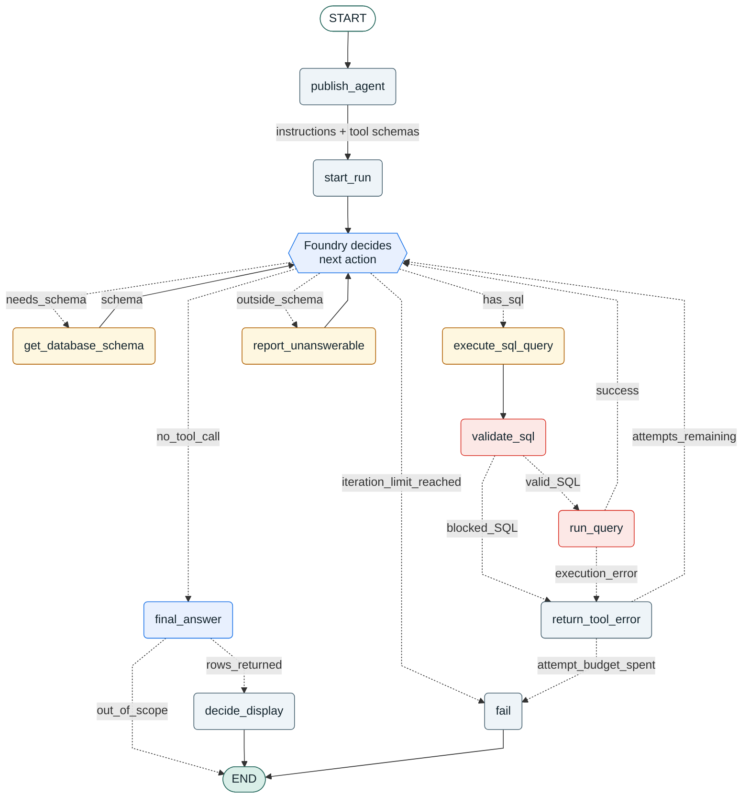
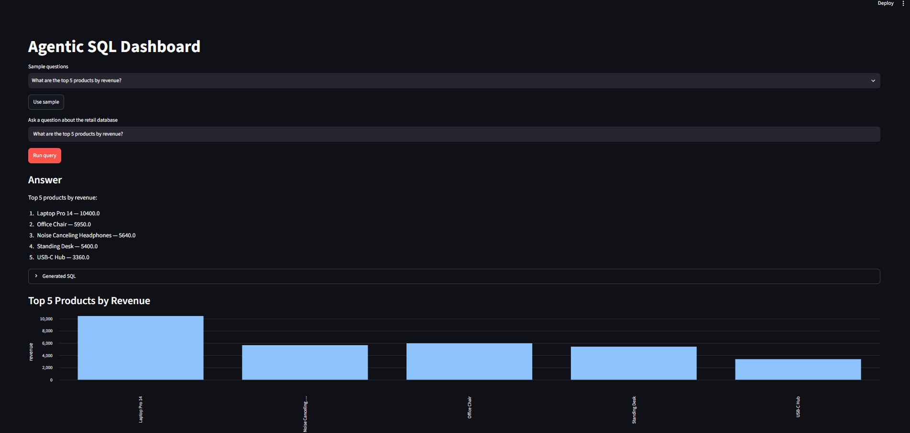
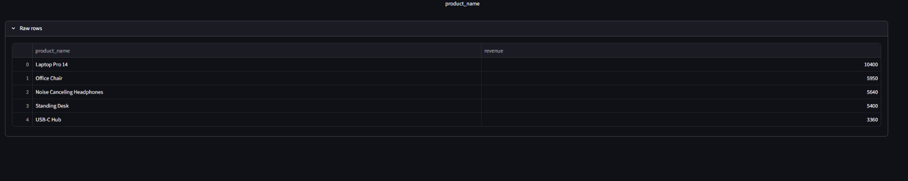

# Agentic SQL Dashboard on Azure AI Foundry Agent Service

A natural-language question becomes a validated SQL query, runs against a retail
database, and returns both an answer and the dashboard element that fits the
actual result: KPI, line chart, bar chart, or table.

This repository is the **Foundry Agent Service** version. The agent loop itself
runs in Azure. There is no LangGraph, no LangChain, and no orchestration code in
this repository at all.

## Why this version exists

An earlier build of the same product orchestrated the agent locally with
LangGraph and used Azure only for the model. This version answers a different
question: what happens when the agent itself is built and executed by Azure,
rather than by application code. The orchestration moves into Azure AI Foundry
Agent Service, and the repository keeps only what genuinely belongs to the
application.

## What moved, and what did not

| Concern | LangGraph version | This version |
| --- | --- | --- |
| Orchestration loop | `backend/graph.py`, `backend/state.py` | **Azure Foundry Agent Service** (no local equivalent) |
| Model invocation | `backend/llm.py` (`AzureChatOpenAI`) | Foundry calls the model itself |
| Retry / self-correction | `MAX_REPAIR_ATTEMPTS` in our graph | Foundry retries; we bound it with `MAX_EXECUTE_ATTEMPTS` |
| Prompts | three prompts (generate, repair, summarize) | one set of agent instructions |
| Tool definitions | implicit in graph nodes | `backend/tools.py`, published with the agent |
| SQL safety boundary | `backend/validators.py` | **unchanged** |
| Database access | `backend/db.py` | **unchanged** |
| Display policy | `backend/display.py` | **unchanged** (display types moved in from `state.py`) |
| API contract | `POST /query` | **identical**, so the UI kept working as-is |
| Authentication | API key in `.env` | **Entra ID**, no key anywhere |

The parts that encode the application's own guarantees — the SQL safety boundary
and the display policy — survived a complete change of orchestration engine
untouched. Only the orchestration itself was replaced.

## Agent workflow

This is the node-and-edge view of how a question gets answered. The decisive
detail is which box is blue: **the branching node runs in Azure, not here.** A
graph framework would put a conditional edge we wrote at every fork. There is
exactly one fork, and Foundry owns it.

Colours: **blue** is Azure, **orange** is a tool the agent may call, **red** is
the safety boundary no model output can bypass, **grey** is application code.



Every tool result returns to `Foundry decides`, and the agent keeps taking turns
until it makes no further tool call. Two counters keep that loop finite, and both
are ours rather than the orchestrator's: `MAX_EXECUTE_ATTEMPTS` caps rejected
queries, `MAX_TOOL_ITERATIONS` caps the conversation. Nothing in Azure would stop
the loop on its own.

Note where `validate_sql` and `run_query` sit. The orchestration is remote, but
every path from the model to the database still passes through them, and
`report_unanswerable` gives the agent a way to decline that produces no SQL at
all.

A system-level view and a turn-by-turn sequence diagram are in
[docs/ARCHITECTURE.md](docs/ARCHITECTURE.md).

### Two safety layers, deliberately

1. **In code**: `validate_select_sql` allows a single `SELECT` that reads real
   tables, rejects multiple statements, and blocks write keywords. Every tool
   call passes through it before any connection is opened.
2. **In the database**: the connection is opened read-only. Even if a write
   somehow passed the validator, the database itself refuses it.

The agent's attempt budget is a third bound, on cost rather than safety:
`MAX_EXECUTE_ATTEMPTS` stops a model that keeps producing invalid SQL, and
`MAX_TOOL_ITERATIONS` bounds the whole conversation.

## Azure resources

| Resource | Kind | Notes |
| --- | --- | --- |
| Resource group | — | one group for everything, a region where the model is available |
| Foundry account | `AIServices` | **not** `OpenAI`; project management must be enabled |
| Foundry project | — | hosts the agent |
| Model deployment | `gpt-5-mini` | `2025-08-07`, GlobalStandard |

An existing Azure OpenAI resource (`kind: OpenAI`) cannot host agents. The
account must be `kind: AIServices` with `allowProjectManagement: true`.

Project endpoint, which is what `PROJECT_ENDPOINT` needs:

```
https://<foundry-account>.services.ai.azure.com/api/projects/<project-name>
```

### Required role assignment

Foundry's agents data plane is **not** covered by subscription `Owner`. Owner
carries `actions` but no `dataActions`, so it can create the Foundry account, the
project, and the model deployment, and then fail on every agent call with:

```
Identity(object id: ...) does not have permissions for
Microsoft.CognitiveServices/accounts/AIServices/agents/read actions
```

Grant the `Foundry User` role on the Foundry account. Note the name: this role
was previously documented as *Azure AI User*, and a script using the old name
fails to resolve it.

```powershell
az role assignment create `
  --assignee-object-id (az ad signed-in-user show --query id -o tsv) `
  --assignee-principal-type User `
  --role "Foundry User" `
  --scope "/subscriptions/<SUBSCRIPTION_ID>/resourceGroups/<RESOURCE_GROUP>/providers/Microsoft.CognitiveServices/accounts/<FOUNDRY_ACCOUNT>"
```

Role propagation takes a minute or two. Every developer needs this assignment
individually; on App Service the managed identity needs it too.

## Setup

```powershell
python -m venv .venv
.\.venv\Scripts\Activate.ps1
python -m pip install -r requirements.txt
Copy-Item .env.example .env
```

`.env` holds **no secrets** — only the project endpoint and the deployment name.
Authentication is Entra ID:

```powershell
az login
```

Seed the demo database:

```powershell
.\.venv\Scripts\python.exe data\seed.py
```

## Run

```powershell
.\.venv\Scripts\python.exe -m uvicorn backend.main:app --reload
```

```powershell
.\.venv\Scripts\streamlit.exe run frontend\app.py
```

Open http://127.0.0.1:8501. Health check: http://127.0.0.1:8000/health.

The agent definition is published to Foundry on first request, so the live agent
always matches the code in this repository rather than something edited by hand
in the portal.

## Sample questions

| Question | Expected display |
| --- | --- |
| What is the total revenue for completed orders? | KPI |
| Show monthly revenue for completed orders. | Line chart |
| What are the top 5 products by revenue? | Bar chart |
| List each product with its category and price. | Table |

Display types are not hardcoded per question. `decide_display` inspects the
returned columns and rows and accepts the agent's `chart_type` only when it
matches the real result shape.

## Worked example

Asking *"What are the top 5 products by revenue?"* — the agent fetched the
schema, wrote the join and aggregation itself, and proposed a bar chart, which
`decide_display` accepted because the result really is one category column plus
one numeric column.



The generated SQL is expandable in the dashboard, and the rows behind the chart
are shown as returned, so nothing about the answer has to be taken on trust.



Every number in the chart traces back to a row the database returned. The SQL for
this run was:

```sql
SELECT p.name AS product_name,
       SUM(oi.quantity * oi.unit_price) AS revenue
FROM order_items oi
JOIN products p ON oi.product_id = p.id
GROUP BY p.id, p.name
ORDER BY revenue DESC
LIMIT 5
```

## Project structure

- `backend/agent.py`: Foundry client, agent definition, and the tool-call loop.
- `backend/tools.py`: tool schemas and their implementations, plus the attempt budget.
- `backend/prompts.py`: the agent's standing instructions.
- `backend/validators.py`: SELECT-only validation and the row limit.
- `backend/db.py`: schema loading and read-only query execution.
- `backend/display.py`: verifies the agent's display hint against actual rows.
- `backend/main.py`: FastAPI endpoints and service-level error handling.
- `frontend/app.py`: Streamlit dashboard. The `POST /query` contract is identical
  to the LangGraph version, so only the progress label and the request timeout
  changed here.
- `data/seed.py`: creates the retail demo database.
- `tests/`: validator, display, and tool-layer tests.

## Tests

```powershell
.\.venv\Scripts\python.exe -m pytest
```

No test calls a real model or a real Azure endpoint. The graph-routing tests are
gone with the graph: Foundry's routing is not ours to unit test. What replaced
them is `tests/test_agent_tools.py`, which tests what the tools do with whatever
the model sends them, including malformed arguments, blocked SQL, and exhausted
attempt budgets.

## Error handling

- Unsafe or invalid SQL is rejected by the validator and returned to the agent as
  a tool error, which it can correct and retry within its budget.
- Questions outside the retail schema go through `report_unanswerable`, so no SQL
  is generated or executed.
- Configuration failures raise `RuntimeError`, which FastAPI maps to `503`.
- Anything else returns `500` with a generic message, and details stay in logs.
- An empty result is shown as user feedback rather than a broken chart.

## Not yet done

- Database is still SQLite. Moving it to Azure SQL is the next step, and touches
  only `backend/db.py` plus a T-SQL seed script.
- Deployment to App Service, where `DefaultAzureCredential` would use a managed
  identity instead of the local `az login` session, with no code change.
