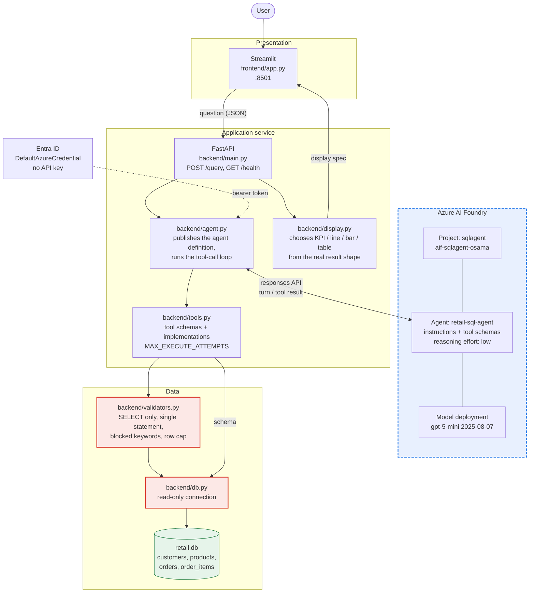

# Architecture

Two views: the system as a whole, then one agent run in detail.

## 1. System architecture

Blue dashed is Azure. Red is our safety boundary. Everything else is our code.



**The division that matters.** Azure decides *what to do next*. We decide *what is
allowed to happen*. Tool bodies execute in our process, so database credentials
never reach Azure and no model output touches the database without passing
`validate_select_sql` first.

## 2. One agent run

Measured on this build: about 2 tool calls and 3 model turns per question, 8–21
seconds end to end, of which our own code accounts for roughly 0.002 seconds.

```mermaid
sequenceDiagram
    autonumber
    actor User
    participant API as FastAPI<br/>backend/main.py
    participant Run as agent.py<br/>tool-call loop
    participant Foundry as Foundry Agent Service<br/>(Azure)
    participant Tools as tools.py
    participant Guard as validators.py
    participant DB as db.py (read-only)
    participant Disp as display.py

    User->>API: POST /query {question}
    API->>Run: answer_question(question)
    Run->>Foundry: publish agent version<br/>(instructions + tool schemas)
    Run->>Foundry: responses.create(question)

    rect rgb(232, 240, 254)
        note over Foundry: turn 1 — Foundry decides it needs the schema
        Foundry-->>Run: function_call: get_database_schema
        Run->>Tools: dispatch_tool_call
        Tools->>DB: load_schema()
        DB-->>Tools: tables, columns, keys
        Tools-->>Run: schema JSON
        Run->>Foundry: function_call_output
    end

    rect rgb(232, 240, 254)
        note over Foundry: turn 2 — writes SQL and a display hint
        Foundry-->>Run: function_call: execute_sql_query<br/>{sql, chart_type, x, y, title}
        Run->>Tools: dispatch_tool_call
        Tools->>Guard: validate_select_sql(sql)

        alt SQL rejected
            Guard-->>Tools: reason
            Tools-->>Run: {ok:false, error, attempts_remaining}
            Run->>Foundry: function_call_output
            note over Foundry: corrects and retries,<br/>bounded by MAX_EXECUTE_ATTEMPTS = 3
        else SQL accepted
            Guard-->>Tools: safe_sql (row cap applied)
            Tools->>DB: execute_select(safe_sql)
            DB-->>Tools: rows, columns
            Tools-->>Run: {ok:true, rows[:20], row_count}
            Run->>Foundry: function_call_output
        end
    end

    rect rgb(232, 240, 254)
        note over Foundry: turn 3 — no more tool calls, writes the answer
        Foundry-->>Run: output_text (final answer)
    end

    Run->>Disp: decide_display(rows, columns, hint)
    note right of Disp: the agent's chart_type is only a hint;<br/>it is overridden when it does not fit<br/>the real column shape
    Disp-->>Run: display spec
    Run-->>API: answer, sql, rows, columns, display
    API-->>User: JSON response

    note over Run,Foundry: whole conversation bounded by<br/>MAX_TOOL_ITERATIONS = 8
```

## 3. Where the time goes

Latency is dominated by model turns, not by data. Measured over 3 repeats of the
four demo questions:

| Component | Time |
| --- | --- |
| `load_schema()` + `execute_select()` — all our database work | **0.002s** |
| One bare model round trip | ~9.5s |
| Model turns per question | 3 |
| Full question, end to end | median 14.9s, range 11.0–22.7s |

Dataset size is not a factor: 6 products, 10 orders, 17 order items. Making the
database ten times bigger would not move these numbers measurably; removing a
model turn would.

The three turns are structural, not waste:

1. the agent asks for the schema,
2. it sends SQL and gets rows back,
3. it writes the answer.

Turn 1 is the one that could be removed, by baking the schema into the agent
instructions at publish time instead of exposing it as a tool. That trades a
round trip for a schema that only refreshes when the agent is republished.

### A warning about measuring this

Run-to-run variance is wide — the same question ranged from 11.0s to 22.7s at a
fixed configuration. A single sample proves nothing here. An earlier comparison
in this project appeared to show a 37% gain from lowering reasoning effort; it
did not survive repetition, and the measurement harness itself was flawed:
`ensure_agent()` is cached, so calling `answer_question()` after publishing a
definition re-publishes from `agent_definition()` and silently overrides the
version under test. Restart the process between configurations.
